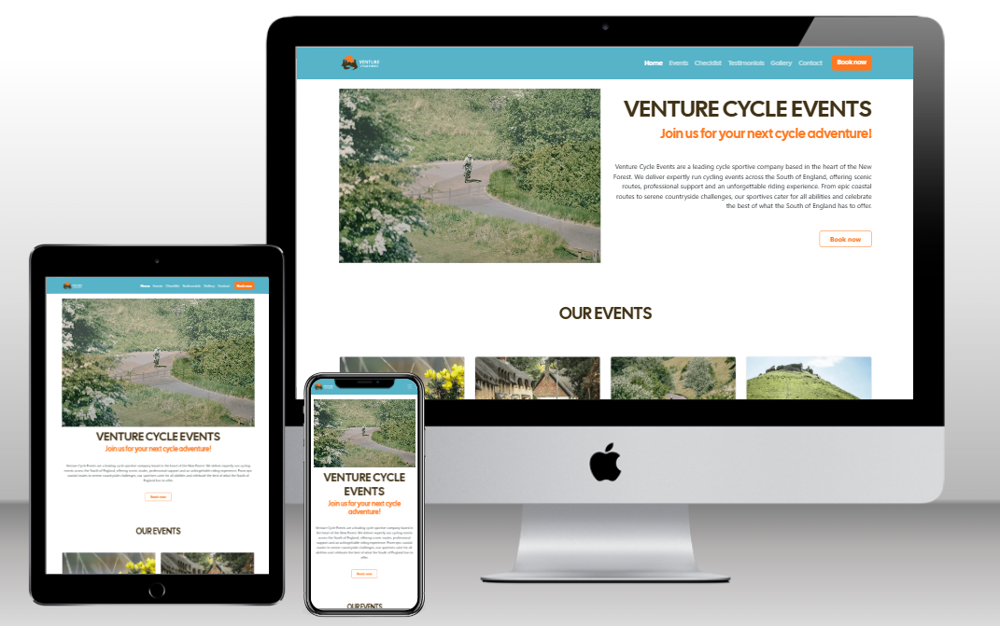

# Venture Cycle Events

### Live website can be found [here](https://darren-longhurst.github.io/venture-cycling-mp-1/index.html).
---
## Project Description

Venture Cycle Events is an events company looking to encourage all levels of cyclists - from recreational to enthuisiast- to get outside and take part in our mass participation cycle events across the South of England.

The Website provides all the neccesary information for participants to make an informed decision about which event to enter. Each event entry card clearly displays the event location, distance, and ride difficulty.

The site also features:

- Striking photos of cyclists and scenic views taken during the events on the homepage.
- A dedicated image gallery.
- A booking form page.
- A contact form.
- booking and contact success pages.
- Newsletter sign up and sucess pages

## Project Purpose

Our mission is ito bring together cyclists of all abilities to explore stunning routes and immerse themselves in the unique and beautiful landscapes of southern England - by bike!

Cycling is great for mental well being, is a low impact sport and is widely accessible.

## Index -Table of Contents

- [UX](#ux)
- [Design](#design)
- [Features](#features)
- [Technologies](#technologies)
- [Testing](#testing)
- [Bugs](#bugs)
- [Depoloyment](#deployment)
- [Credits](#credits)
---
## UX

### User Stories

1. As a first time visitor, I want to quickly understand what the brand is about and whether entering a cycle event is something that interests me.

2. As a potential customer or past event entrant, I want to browse a gallery of past events, so that I can see what the experience is like or download a picture of myself as a momento.

3. As a first time or returning customer I want to quickly and easily locate and book an event to reserve my entry without needing to email or call.

4. As a potential customer, I'm looking to sign up to a newsletter to receive updates on upcoming events, event availability and offers.

5. As someone new to cycling, I'm looking to book my first event and curious to see what I would need to bring along with me for the ride.

6.  As a recreational rider I want to read testimonials from past entrants to hear about their experiences so I can feel confident about entering an event.

7. As a website user, I want to contact the company about any questions that I might have.

## Design

### Colour Scheme

* For the colour scheme I have used an image picker to draw some of the more prominent colours from the main Hero image on the site and from the company logo.
* The orange from the logo is used for all the buttons on the site with the dark brown colour on button hover. Text is kept white for good accesibility with both button colours. 
* The body of the site has a white background and dark brown text for better user accessibility.
* The Nav bar and footer are both be using cyan from the palette.
* The newsletter signup, uses dark brown background and white text.

## Typography

Typography chosen for the site is the same as used in the company logo - Open Sans and Cal Sans, these are imported from Google Fonts. They are widely used fonts, used on almost all browsers. If unavailable on the recipient browser however, the fall back font for both is Sans-Serif.

H1, H2, H3 Heading fonts will all use variations of Cal Sans.

## Home Page

* On the landing page, users are drawn to the "Our Events" button, which scrolls the page to the events showcase area. 
* I have x2 variants of button throughout the site. Version one which appears in the blue nav bar and newletter sections is a solid orange button with white text buttons change from solid orange to a white outline on hover over.
Version two, which appears throughout the rest of the site is an outlined orange button which turn to solid orange on hover with the white text giving a good contrast in colour for both options.
* In the footer, all social media links will open on a new windown on selection.

### Images

For the Hero images, event images and the gallery images, I have kindly been allowed to use imagery from a cycle event companies website. I have credited them at the end of this document. Links to these images are here (re-sized for README):

* [cambridge-autumn](assets/images/cambridge-autumn.jpg)
* [jurassic-corfe-castle](assets/images/jurassic-corfe-castle.jpg)
* [jurassic-coast-downhill](assets/images/jurassic-downhill.jpg)
* [jurassic-coast-uphill](assets/images/jurassic-uphill.jpg)
* [jurassic-coast-uphill-two](assets/images/jurassic-uphill-two.jpg)
* [new-forest-cyclists](assets/images/new-forest-2up.jpg)
* [peak-district](assets/images/peak-district-hill.jpg)
* [box-hill-surrey](assets/images/surrey-hills-box-hill.png)
* [surrey-cyclists](assets/images/cycle-club-surrey.png)
* [gorse-bush](assets/images/gorse-bush-new-forest.png)
* [cyclists-beach](assets/images/lepe-beach.png)
* [box-hill-surrey-two](assets/images/surrey-box-hill-two.jpg)

### Wireframes

Wireframes and layout inception started with the use of Balsamiq.
All pages from the website and its dynamic responsiveness are shown here from mobile phone to large desktop screens.

* [Home Page](wireframes/homepage.png)
* [Booking Page](wireframes/booking-request-page.png)
* [Contact Us Page](wireframes/contact-us-page.png)
* [Gallery Page](wireframes/gallery-page.png)
* [Success Page](wireframes/success-page.png)

# Features

## Page Features

### Navigation Bar

The navigation bar is consistent over all 6 pages, is fully responsive and using bootstrap class "fixed-top" and remains in view wherever the user is scrolling. Also utilising #id within the nav bar html, the user can auto scroll to sections #our-events, #rider-checklist or #testimonials on the landing page, by selecting the relevant section within the nav bar, whichever page the user is on.

#### Full size navigation bar

#### Drop down navigation bar

### Footer

The footer section, visible on all pages includes a newsletter signup section and the social media icons. All clickable links have hover over attributes enabled for visual distinction and "_blank" attributes ensuring new tabs are opened when links are clicked.

### Features by page

#### Home page

The main goal of the website is to promote new bookings, so emphasis has been put on drawing the users focuus to the "events" section of the landing page. The events option in the nav bar also auto scrolls to the events section once selected. There are call to action buttons within the main heading text area with carousel image slider and on every one of the events cards within the events section. These buttons all serve the same purpose, to direct the user to the booking page.
The events section itself was created using bootstrap cards componenets and is fully resposive.

#### Booking page

The booking page features a form section, is fully responsive and contains field relevant "required" attributes. The dropdown contains the event listing for each of the events detailed in the events section of the home page.

## Featured and future code implementations

I have used custom CSS variables to easily name and recall my colour palette which works well. This would make it easy to change my colour palette or fonts in the future if company brand guidelines were to change.
I have a couple of stretch goals left in github projects that I would have loved to include in the project if time allowed including a full events details page (as opposed to a more generic booking form) with extended route detail, a downloadable .gpx route file for riders and a visible google map showing the venue location. The second stretch goal would have been a training section, navigating users to a dedicated training program in the lead up to the event. These were however "could have" users stories and prioritising my user story goals using github projects enabled me to deliver the course in a timely manner.

---

## Technologies

* HTML5 and CSS programming languages
* [Bootstrap](https://getbootstrap.com/) 5.3.3
* Visual Studio Code - As my IDE using command line to push code to GitHub
* Github - To host my repository

## Design

* [Font Awesome](https://fontawesome.com/) 7
* Cal Sans and Open Sans fonts from [Google Fonts](https://fonts.google.com/) 
* [Wireframes](https://fonts.google.com/) from Balsamiq
* Images from [Pexels](https://www.pexels.com/)
* Colour palette maker from [coolors](https://coolors.co/)

## Testing

* [W3C HTML](https://validator.w3.org/) HTML markup validator 
* [W3C CSS](https://jigsaw.w3.org/css-validator/) validator 
* Testing responsiveness, performance and accessibilty with Google Dev tools and lighthouse

### Responsiveness and browser compatibility

* Website tested across multiple browsers (Chrome/Safari/IE/Firefox) and using all available options of device screensize through Chrome dev tools for responsiveness. Dev tools has been great for ironing out padding issues linked to various screen sizes which I'll elaborate on in the #bugs section.

## Validator testing

### HTML

* [W3C HTML](https://validator.w3.org/) used to check validation of each page of the project and check for any code sytax errors throughout.
* One error code found being a forward / before the closing bracket around the favicon section in the header within index.html where no closing / was needed, using the find and search function within vs code, all unwanted items were removed and retested receiving a pass.

## CSS

[W3C CSS](https://jigsaw.w3.org/css-validator/) validator was again used to check validity, no errors were reported.

### Lighthouse

Once validity testing was complete I used Chrome Devtools lighthouse to check perfomrmance and accessibility.

### Home page

I will display my pre optimisation and post optimisation lighthouse results and demonstrate how I achevied my post optimisation results.

#### Pre - optimisation

#### Post - optimisation

## Bugs

Before optimisation, the page suffered from extensive loading times. This was becasue the images were not formatted correctly or optimised for the page. In order I:
* resized all image files, gallery images to 300x400px and event cards to 400x250px
* Reformatted .png file types to .webp
* Optimised image size using [Image Resizer](https://imageresizer.com/image-compressor) to reduce the image size by 50%

Lighthouse also flagged contrast in the nav bar, so I improved this by adding enhanced custom CSS to increase the font weight of the custom buttons and the nav bar headings.

### Other bugs of note

* Installing Bootstrap 5.3.6 completely removes the ability to use custom CSS, I used a process of elimination to find this out by commenting out various sections of code until removing bootstrap enabled me to see my custom styling. I reverted to a previous version of bootstrap (5.3.3) to fix this.
* There were multiple incidents of needing to use increased attribute specificity in order to apply custom CSS styling becasue of Bootstrap conflicts. One example being my use of custom button CSS styling, I had to add an additional attribute of .btn along with my custom class attribute of .custom-button-outline in order to target the HTML succesfully.
* Once I implimented the "fixed-top" nav bar I also had some issues with the nav bar fouling the carousel image with screen sizes but not all. I had to utilise media queries with this to resolve:

## Deployment

The project was deployed to GitHub Pages using the following steps...

1. Log in to GitHub and locate the [GitHub Repository](https://github.com/)
2. At the top of the Repository (not top of page), locate the "Settings" Button on the menu.
 - Alternatively Click [Here](https://github.com/) for a GIF demonstrating the process starting from Step 2.
3. Scroll down the Settings page until you locate the "GitHub Pages" Section.
4. Under "Source", click the dropdown called "None" and select "Master Branch".
5. The page will automatically refresh.
6. Scroll back down through the page to locate the now published site link in the "GitHub Pages" section.
## Forking
By forking the GitHub Repository we make a copy of the original repository on our GitHub account to view and/or make changes without affecting the original repository by using the following steps...
Scroll back down through the page to locate the now published site link in the "GitHub Pages" section.
1. Log in to GitHub and locate the [GitHub Repository](https://github.com/)
2. At the top of the Repository (not top of page) just above the "Settings" Button on the menu, locate the "Fork" Button.
3. You should now have a copy of the original repository in your GitHub account.
## Making a Local Clone
1. Log in to GitHub and locate the [GitHub Repository](https://github.com/)
2. Under the repository name, click "Clone or download".
3. To clone the repository using HTTPS, under "Clone with HTTPS", copy the link.
4. Open Git Bash
5. Change the current working directory to the location where you want the cloned directory to be made.
6. Type `git clone`, and then paste the URL you copied in Step 3.

    <pre><code>`$ git clone https://github.com/YOUR-USERNAME/YOUR-REPOSITORY`</code></pre>

7. Press Enter. Your local clone will be created.

    <pre><code>$ git clone https://github.com/YOUR-USERNAME/YOUR-REPOSITORY`
    Cloning into `CI-Clone`...
    remote: Counting objects: 10, done.
    remote: Compressing objects: 100% (8/8), done.
    remove: Total 10 (delta 1), reused 10 (delta 1)
    Unpacking objects: 100% (10/10), done.</code></pre>

## Credits 

* For inspiration and the use of some of the images throughout the website UK Cycling Events [UKCE](https://www.ukcyclingevents.co.uk/) UK Cycling Events
* Images for the testimonial section of the homepage were from [Pexels](https://www.pexels.com/).
* When stuck in a bit of a code block, I found [W3 Schools](https://www.w3schools.com/) particularly helpful.
* For formatting HTML and CSS I used [Beautifier.io](https://beautifier.io/)

